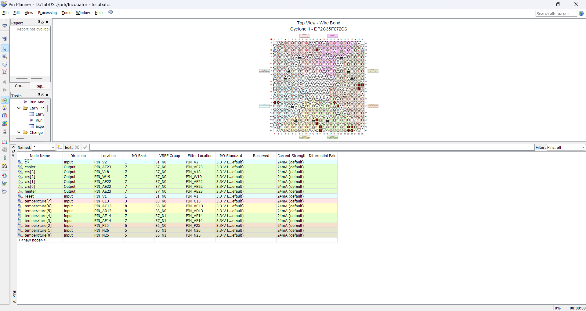
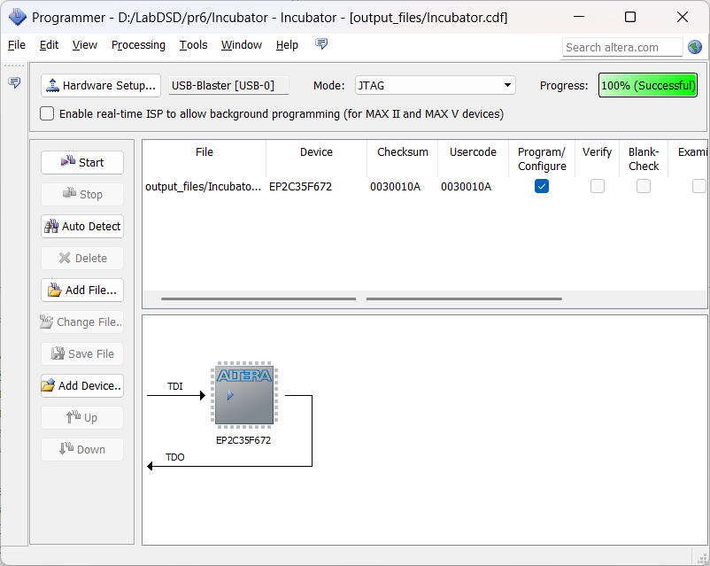

### 📘 گزارش آزمایش: طراحی سیستم کنترل دما (انکوباتور)
**آزمایش ششم - درس آزمایشگاه طراحی سیستم‌های دیجیتال**

**انجام‌دهندگان:**
- حسین مسیحی - 401110891  
- محمد عارف زارع زاده - 401106017  
- محمد ارمیا قاصری - 402111391  

---

### 🎯 هدف آزمایش

در این آزمایش هدف طراحی و پیاده‌سازی یک سیستم کنترل دما (انکوباتور) با استفاده از واحد کنترل دیجیتال است. سیستم شامل سنسور دما، المنت گرم‌کننده (Heater)، خنک‌کننده (Cooler)، و فن (Fan) است. با توجه به دمای ورودی، این اجزا به صورت خودکار روشن یا خاموش می‌شوند.

---

### 🌀 توضیح نمودار حالت

واحد کنترل دیجیتال با استفاده از دو نمودار حالت مختلف طراحی شده است:

#### 🔹 نمودار حالت اول (سمت چپ)
این نمودار وضعیت‌های Heater و Cooler را کنترل می‌کند:
- **S1**: هر دو خاموش (Heater: OFF, Cooler: OFF)
- **S2**: فقط Cooler روشن
- **S3**: فقط Heater روشن

**شرایط انتقال بین حالت‌ها:**
- دما < 15 → رفتن به S3 (روشن شدن Heater)
- دما > 35 → رفتن به S2 (روشن شدن Cooler)
- دما بین 15 و 35 → بازگشت به حالت S1

#### 🔹 نمودار حالت دوم (سمت راست)
در این نمودار سرعت چرخش فن (Cooler Rotational Speed - CRS) بسته به دما تنظیم می‌شود:
- دما > 35 → CRS = 4 RPS
- دما > 40 → CRS = 6 RPS
- دما > 45 → CRS = 8 RPS
- دما کاهش یابد → به حالت پایین‌تر برمی‌گردد

---

### 🛠️ کد Verilog پیاده‌سازی شده

```verilog
module TemperatureControl(
    input wire clk,
    input wire reset,
    input wire signed [7:0] temperature,
    output reg heater,
    output reg cooler,
    output reg [3:0] crs
);

  parameter  S1 = 2'b00; // Heater: OFF, Cooler: OFF
  parameter  S2 = 2'b01; // Heater: OFF, Cooler: ON
  parameter  S3 = 2'b10; // Heater: ON, Cooler: OFF

  reg [1:0]  current_state, next_state;

always @(posedge clk or posedge reset) begin
    if (reset) begin
        current_state = S1;
        cooler = 0;
        heater = 0;
        crs = 0;
    end else begin
        current_state = next_state; 

        heater = 0; 
        cooler = 0;
        next_state = current_state;

        case (current_state)
            S1: begin
                crs = 0;
                if (temperature < 15) begin
                    heater = 1;
                    next_state = S3;
                end else if (temperature > 35) begin
                    cooler = 1;
                    next_state = S2;
                end
            end
            
            S2: begin
                if (temperature < 25) begin
                    next_state = S1;
                    crs = 0;
                end else begin 
                    cooler = 1;
                    if (crs == 0) begin
                        if (temperature > 35) begin
                            crs = 4;
                        end
                    end else if (crs == 4) begin
                        if (temperature > 40) begin
                            crs = 6;
                        end else if (temperature < 25) begin
                            crs = 0;
                        end
                    end else if (crs == 6) begin
                        if (temperature > 45) begin
                            crs = 8;
                        end else if (temperature < 35) begin
                            crs = 4;
                        end
                    end else if (crs == 8) begin
                        if (temperature < 40) begin
                            crs = 6;
                        end
                    end
                end
            end
            
            S3: begin
                crs = 0;
                if (temperature > 30) begin
                    next_state = S1;
                end else begin
                    heater = 1;
                    next_state = S3;
                end
            end

            default: next_state = S1;
        endcase
    end
end

endmodule
```
## تصویر پین ها ست شده 


## 🖼️ تصویر خروجی دیجیتال (Logic Analyzer)

## تصویر کامپایل بروی بورد


## 🔌 تصویر برد پیاده‌سازی‌شده


---
### ✅ نتیجه‌گیری

این پروژه با موفقیت یک سیستم کنترلی ساده و واکنش‌گرا برای تنظیم دما پیاده‌سازی می‌کند. با توجه به دمای ورودی، سیستم به صورت خودکار Heater و Cooler را روشن یا خاموش می‌کند و سرعت فن را نیز تنظیم می‌کند. این سیستم قابلیت اجرا روی بردهای FPGA را دارد.
