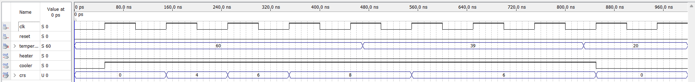
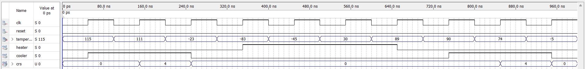
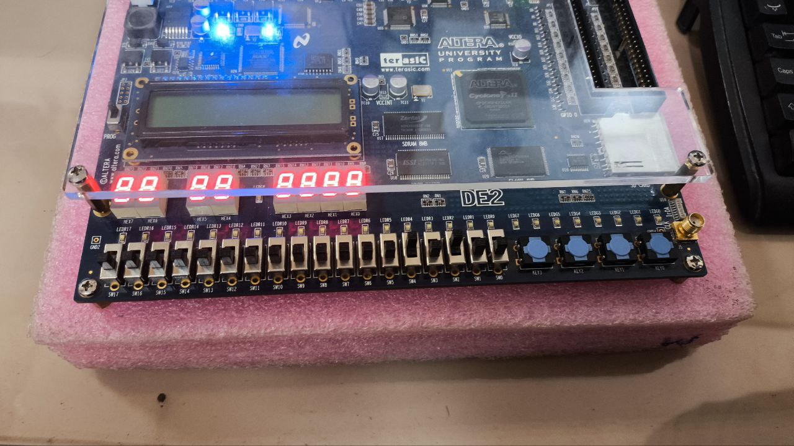
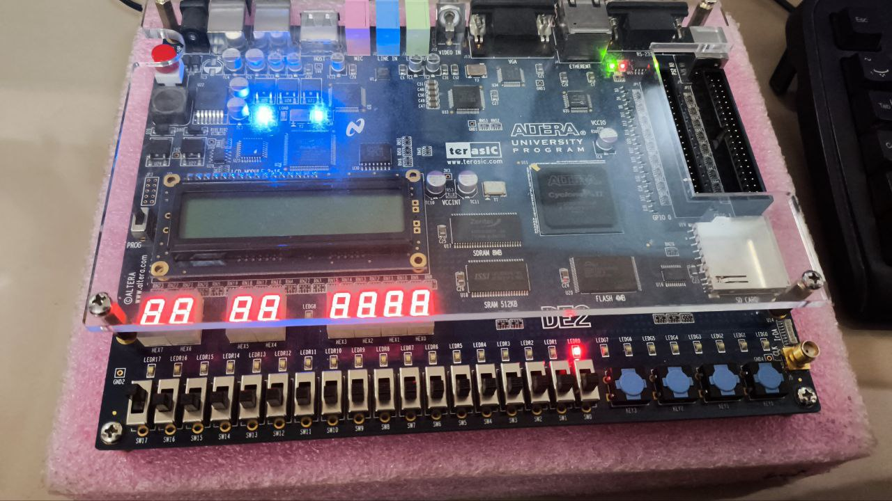
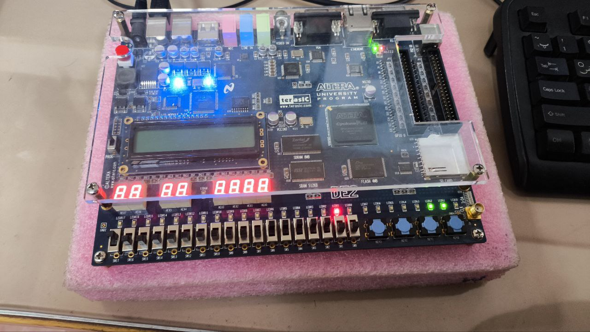
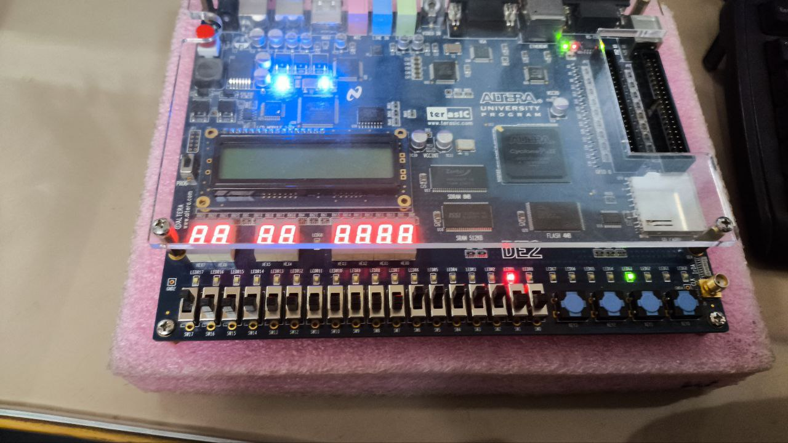
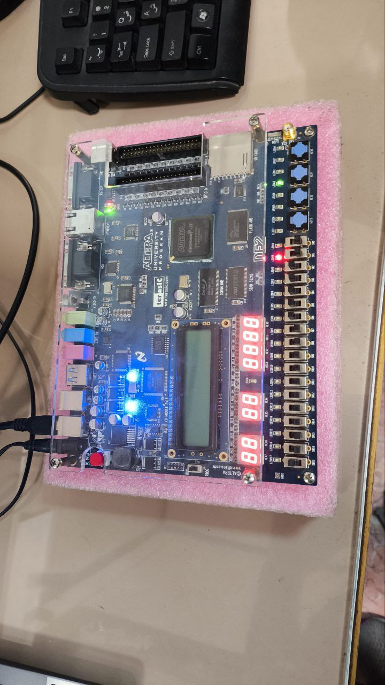

<p align="center">
  
</p>

<h3 align="center">📘 گزارش آزمایش: طراحی سیستم کنترل دما (انکوباتور)</h3>
<p align="center"><b>آزمایش ششم - درس آزمایشگاه طراحی سیستم‌های دیجیتال</b></p>

---

### 👨‍🔬 انجام‌دهندگان
- حسین مسیحی – 401110891  
- محمد عارف زارع زاده – 401106017  
- محمد ارمیا قاصری – 402111391  

---

### 🎯 هدف آزمایش

در این آزمایش هدف طراحی و پیاده‌سازی یک سیستم کنترل دما (انکوباتور) با استفاده از واحد کنترل دیجیتال است.  
سیستم شامل اجزای زیر می‌باشد:
- **سنسور دما**
- **المنت گرم‌کننده (Heater)**
- **خنک‌کننده (Cooler)**
- **فن (Fan)**

با توجه به دمای ورودی، این اجزا به صورت خودکار کنترل می‌شوند.

---

### 🌀 نمودارهای حالت

#### 🔹 نمودار اول: کنترل Heater و Cooler

| حالت | توضیحات |
|------|----------|
| S1 | هر دو خاموش (Heater: OFF, Cooler: OFF) |
| S2 | فقط Cooler روشن |
| S3 | فقط Heater روشن |

**شرایط تغییر حالت‌ها:**
- دما < 15 → حالت S3 (Heater روشن)
- دما > 35 → حالت S2 (Cooler روشن)
- دما بین 15 و 35 → بازگشت به S1

#### 🔹 نمودار دوم: تنظیم سرعت فن (CRS)

| دما | سرعت چرخش فن (CRS) |
|-----|---------------------|
| > 35°C | 4 RPS |
| > 40°C | 6 RPS |
| > 45°C | 8 RPS |

هنگام کاهش دما، CRS به سطح پایین‌تر بازمی‌گردد.

---

### 🛠️ کد Verilog پیاده‌سازی‌شده

<details>
<summary>مشاهده کد</summary>

```verilog
module TemperatureControl(
    input wire clk,
    input wire reset,
    input wire signed [7:0] temperature,
    output reg heater,
    output reg cooler,
    output reg [3:0] crs
);

  parameter  S1 = 2'b00; // Heater: OFF, Cooler: OFF
  parameter  S2 = 2'b01; // Heater: OFF, Cooler: ON
  parameter  S3 = 2'b10; // Heater: ON, Cooler: OFF

  reg [1:0]  current_state, next_state;

always @(posedge clk or posedge reset) begin
    if (reset) begin
        current_state = S1;
        cooler = 0;
        heater = 0;
        crs = 0;
    end else begin
        current_state = next_state; 

        heater = 0; 
        cooler = 0;
        next_state = current_state;

        case (current_state)
            S1: begin
                crs = 0;
                if (temperature < 15) begin
                    heater = 1;
                    next_state = S3;
                end else if (temperature > 35) begin
                    cooler = 1;
                    next_state = S2;
                end
            end
            
            S2: begin
                if (temperature < 25) begin
                    next_state = S1;
                    crs = 0;
                end else begin 
                    cooler = 1;
                    if (crs == 0) begin
                        if (temperature > 35) begin
                            crs = 4;
                        end
                    end else if (crs == 4) begin
                        if (temperature > 40) begin
                            crs = 6;
                        end else if (temperature < 25) begin
                            crs = 0;
                        end
                    end else if (crs == 6) begin
                        if (temperature > 45) begin
                            crs = 8;
                        end else if (temperature < 35) begin
                            crs = 4;
                        end
                    end else if (crs == 8) begin
                        if (temperature < 40) begin
                            crs = 6;
                        end
                    end
                end
            end
            
            S3: begin
                crs = 0;
                if (temperature > 30) begin
                    next_state = S1;
                end else begin
                    heater = 1;
                    next_state = S3;
                end
            end

            default: next_state = S1;
        endcase
    end
end

endmodule
```

</details>

---

### 🧪 خروجی‌ها و پیاده‌سازی سخت‌افزاری

#### 📌 پیکربندی پایه‌ها
<p align="center">
  
</p>

#### 📊 خروجی Logic Analyzer
<p align="center">
  
  
</p>

#### 🔧 تصویر کامپایل بر روی برد
<p align="center">
  
</p>

#### 🖼️ تصاویر برد پیاده‌سازی‌شده
<p align="center">
  
  
  
  

[//]: # (  )
</p>

---

### ✅ نتیجه‌گیری

در این پروژه، یک سیستم کنترلی دقیق برای دما طراحی و پیاده‌سازی شد.  
این سیستم با در نظر گرفتن دمای ورودی:
- المنت گرمایی و خنک‌کننده را کنترل می‌کند.
- سرعت فن را به‌صورت دینامیک تنظیم می‌نماید.

قابلیت اجرای این پروژه بر روی بردهای **FPGA** با موفقیت مورد آزمایش قرار گرفت.
