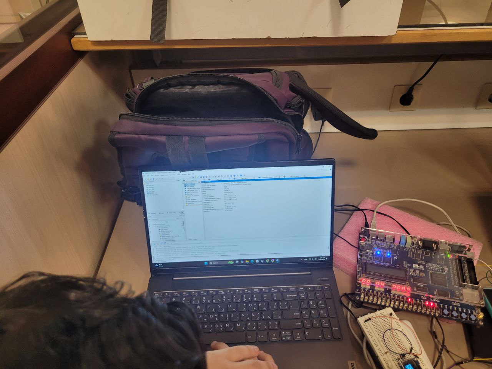
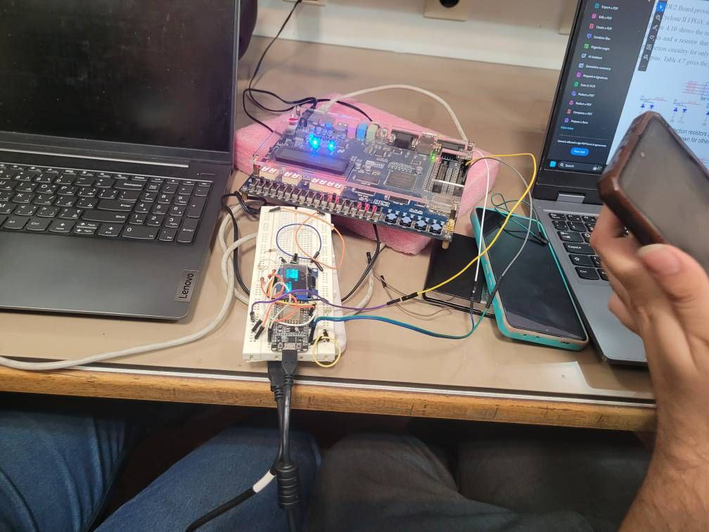
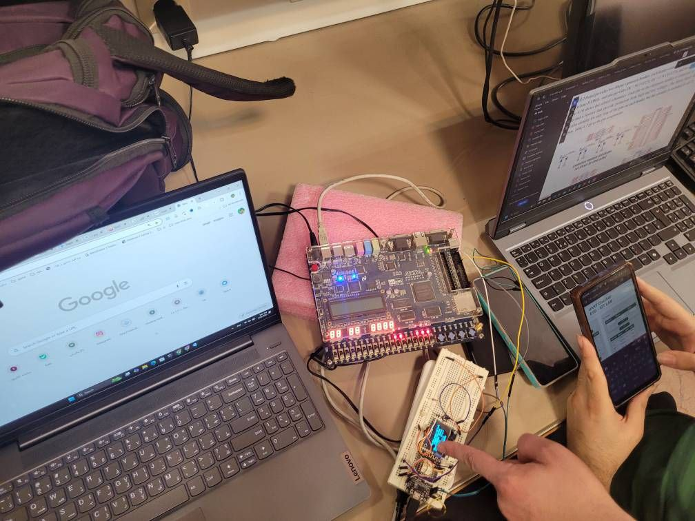

  

# 🧪 آزمایش شماره ۷ — پیاده‌سازی ارتباط UART بین دو FPGA

## 🎯 هدف آزمایش

هدف از این آزمایش، طراحی و پیاده‌سازی یک سیستم ارتباطی سریال بین دو واحد FPGA با استفاده از پروتکل UART می‌باشد. این سیستم می‌بایست داده‌های ASCII را به صورت ۱۰ بیت شامل بیت شروع، ۷ بیت داده، بیت پریتی و بیت توقف ارسال و دریافت کند.

## 📦 ساختار فریم UART

| بیت | توضیح                           |
| --- | ------------------------------- |
| 1   | Start (همیشه 0)                 |
| 7   | Data (مثلاً کاراکتر 'A' = 0x41) |
| 1   | Parity (Even parity)            |
| 1   | Stop (همیشه 1)                  |
| 🔢  | مجموع: 10 بیت                   |

## ⚙️ مشخصات فنی

* فرکانس کلاک: 50MHz
* نرخ ارسال داده: 115200 bps
* نسبت کلاک به بیت: `CLK_PER_BIT = 434`

## 🧵 طراحی سیستم

### 📤 ماژول `uart_tx`

فرستنده‌ای است که فریم ۱۰ بیتی را با ترتیب \[Stop | Parity | Data | Start] تشکیل داده و بیت به بیت روی خط `tx` ارسال می‌کند. در حالت آماده بودن، با دریافت سیگنال `start` فعال می‌شود و بیت‌ها را با فاصله‌ی دقیق ارسال می‌کند. از یک تابع داخلی برای محاسبه پریتی استفاده شده است.

### 📥 ماژول `uart_rx`

گیرنده‌ای که با تشخیص بیت شروع، وارد وضعیت دریافت می‌شود. هر بیت را در فواصل مشخص دریافت کرده و پس از کامل‌شدن فریم، بیت پریتی را بررسی و نتیجه را در خروجی `ready` و `error` منعکس می‌کند.

### 🧩 ماژول `uart_top`

ماژول بالا‌دستی است که ارسال را با فشردن دکمه `btn_send` کنترل می‌کند. داده ورودی از طریق سوییچ‌ها (`sw_data`) گرفته شده و در خروجی `leds` نشان داده می‌شود. در صورت بروز خطای پریتی، `led_error` روشن می‌شود.

### 🧪 ماژول تست `uart_top_test`

دو فرستنده (`tx1`, `tx2`) و دو گیرنده (`rx1`, `rx2`) تعریف شده‌اند. داده‌ها (مثلاً 'A' و 'B') به‌صورت داخلی به گیرنده‌ها ارسال می‌شوند و نتایج روی `leds1`, `leds2` و خروجی‌های `err1`, `err2` قابل مشاهده است.

## 🧪 شبیه‌سازی و تست

* در محیط تست بنچ، ماژول‌های `uart_tx` و `uart_rx` مستقیماً به یکدیگر متصل شده‌اند.
* کاراکتر 'A' به صورت سریال ارسال شده و در سمت گیرنده بدون خطا دریافت گردید.
* صحت بیت پریتی با XOR داده بررسی می‌شود و در صورت ناهماهنگی، خروجی `error` فعال می‌گردد.
* در FPGA واقعی نیز با دکمه ارسال و مشاهده‌ی LED، صحت عملکرد در شرایط فیزیکی بررسی شد.

## 🌐 تست آنلاین

با استفاده از وب‌سایت [espike.it/uart.html](https://espike.it/uart.html) صحت داده‌های ارسال‌شده نیز تست و تأیید گردید.

## 🖼 تصاویر (در صورت وجود اضافه شود)

* شماتیک اتصالات TX/RX بین دو FPGA
* نمایش کاراکتر دریافتی روی LEDها
* عکس اسکوپ یا لاجیک آنالایزر از سیگنال UART

## 📁 فایل‌های مهم پروژه

| نام فایل          | توضیح                                        |
| ----------------- | -------------------------------------------- |
| `uart_tx.v`       | ماژول فرستنده UART                           |
| `uart_rx.v`       | ماژول گیرنده UART                            |
| `uart_top.v`      | کنترل‌گر اصلی برای ارسال و دریافت توسط کاربر |
| `uart_top_test.v` | ماژول تست داخلی دو UART                      |
| `uart_tb.v`       | تست بنچ اولیه ارسال و دریافت ساده            |
| `pin_planner.qsf` | فایل تنظیم پین‌ها (در صورت وجود)             |

## ✅ نتیجه‌گیری

با طراحی دقیق فرستنده و گیرنده UART همراه با پریتی، توانستیم یک ارتباط سریال بین دو برد FPGA برقرار کنیم. سیستم با موفقیت کاراکترهای ASCII را به‌صورت سریال منتقل کرده و درستی آن را بررسی نمود. این پروژه پایه‌ای برای ارتباط‌های سخت‌افزاری پیچیده‌تر در طراحی سیستم‌های تعبیه‌شده محسوب می‌شود.

---

## 🖼 تصاویر

### 🎛 نمای کلی ارتباط بین دو UART

### 📟 ارسال و دریافت کاراکتر در عمل (نشان داده‌شده روی LEDها)

### 📊 سیگنال‌های UART 

---
